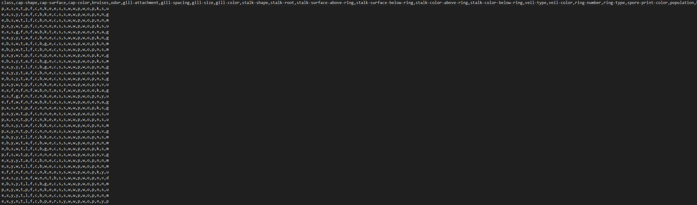

## Body

Mushroom Classification

The dataset contains descriptions of hypothetical samples related to 23 species of Basidiomycetes mushrooms (of the Agaricus and Lepiota genera), taken from the "Field Guide to Mushrooms in North America" (1981 edition). Each mushroom is clearly categorized as either definitely edible, definitely poisonous, or edible but not recommended due to unknown toxicity. The latter category is merged with the poisonous group. The guide explicitly states that there are no simple rules for determining whether a mushroom is edible; nor does it have rules like "Three leaves, let it grow."

## Images

Here is a pay link on Stripe ( https://buy.stripe.com/3cs8yP7sY87d0vu9AB ). Please contact me lonlonago@foxmail.com after funding $89, and I will send you a complete data files , thank you!

